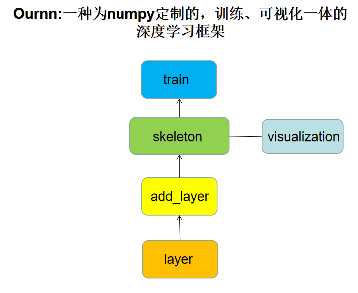

# Ournn:一种为numpy定制的，训练、可视化一体的深度学习框架

## 关于Ournn：
1. Ournn 是为numpy量身定制的类深度学习框架，致力实现numpy格式的数据进行深度学习，其主要的目标如下:    
    * (1)可训练-能够进行最基本的深度学习训练是该框架最基本的目标。
    * (2)性能达标-我们将从两个角度进行提升：
        * 开发GPU版本的numpy数据包。
        * 对框架中计算复杂度比较高的部分进行改动。 
    * (3)可视化-可视化是深度学习研究中必不可少的环节，我们致力于将部分重要的可视化环节封装到框架中，从而让用户避开收集数据、自行可视化的繁琐流程。
    * (4)简洁简洁再简洁-我们希望简单化搭建神经网络的过程，从而让人们不需要有太多框架使用经验就可快速上手，这是本项目的最终目标。

-----------------------------

2. 为了实现以上目标，我们付出了一定精力，且目前已经有了些许进展：
    * (1)常用函数-我们已经在框架中封装了最基本的一些函数，比如 神经网络方面 全连接层、卷积层以及个别的的激活函数和损失函数以及部分数据处理函数
    * (2)搭建网络-通过参考其他人的框架，以及结合个人的懒癌精神，设计了心目中比较方便的网络搭建方法，在下文中有详细地介绍。
    * (3)初步尝试将训练过程中的一些关键信息实现可视化。

-----------------------------

3. 我们也清晰地认识到，该项目距我们的最终目标还有一段距离，所以接下来我们的重心在于：
    * (1)进一步优化整体的设计思路。
    * (2)补充、完善目前深度学习所需要的各类函数。

-----------------------------
    
4. 该项目的特色：
    * (1)该项目基于numpy，也就是只要具备numpy基础就可以按照自己的思路去修改，去实现更灵活的功能。
    * (2)该项目力求简化可视化流程从而提高效率。

总而言之，我们希望利用有限的时间将该项目打造为有应用价值的开源项目，也欢迎对此项目感兴趣的人加入。  

---------------------------------------------------------

## 文件说明：


文件夹|介绍|
:---:|:---|
"Layer"|"Layer"中包含两个文件夹,"activations.py"与"layers.py". "layers.py"中有深度学习中常用的层比如全连接、卷积层。 “activations.py"中包含着常用的激活函数比如“relu”|
“tools”|“matrix_tools.py”是一些涉及到矩阵操作的工具，比如矩阵的广播、矩阵的点乘、zero_padding 等等；“pre_process.py”涉及到一些数据的预处理，比如热编码或者训练数据、测试数据集分割，等等；“visualization.py”则负责训练过程中或者训练后的可视化等等  |
“frame.py”|这是框架主干部分，通过实例化其中的"skeleton"类，并向其中通过指定的函数传入神经网络层、优化器可以实现后续的训练过程。其所有的函数如下： "add":该方法用于将layer封装到模型中,参数可以选择实例化的某个神经网络层抑或一个含有神经网络层的list； “train”：调用该函数传入训练数据和优化器实现模型训练； “backward”：调用该方法实现反向传播； “predict”：向前传播；“save_weights”:保存权重； “load_weights”:加载权重； “show_info": 加载模型参数以及维度信息；”visualization“：训练可视化 |
”losses.py“|常用的损失函数，目前包含交叉熵以及MSE|
”optimizers.py“|优化器，目前只有SGD|

------------------------------------------------------------------------

## 使用方法
### 1.安装
第一步，找到你编译器的环境路径path，打开Linux终端后

    cd path

第二步，克隆Ournn,如果下载遇到问题，请换源或者在url后方添加镜像。
    
    git clone https://github.com/stevezhangz/ournn.git

第三步，安装numpy，matplotlib

    sudo apt-get install pip3
    sudo apt-get install ipython3
    pip3 install numpy
    pip3 install matplotlib

    
 最后，验证框架是否可用,注意这里我为了方便使用了tensorflow中的一个数据集，各位如果没有tensorflow，可以将该数据集换成相同size的随机数。
 
    ipython3 ournn/test.py

### 2.搭建模型的示例
首先给出完整的流程：


    import numpy as np
    from tensorflow.keras.datasets import mnist
    from ournn.tools.preprocess import sparse_one_hot_encode
    from ournn.tools.matrix_tools import *
    from ournn.frame import skeleton
    from ournn.Layer.layers import *
    from ournn.optimizers import *
    from ournn.losses import *

    #加载mnist数据集
    (x,y),(t,d)=mnist.load_data()
    x=np.expand_dims(x,axis=-1)
    y=y.reshape(-1,1)
    x,y=x[0:400],y[0:400]
    x=(x-x.max())/(x.max()-x.min())
    #热编码
    y=sparse_one_hot_encode(y)
    #初始化框架
    sk=skeleton(name="Model1",Regularization=None)
    #将不同的层添加到框架中
    sk.add(
        [
        Conv2d(kernal_size=(5,5),padding=True,stride=2,channel_in=1,channel_o=3),
        Flatten(),
        Fully_connected( output_dim=500,act="relu"),
        Fully_connected( output_dim=100,act="relu"),
        Fully_connected(output_dim=10,act="relu")
        ]
    )
    #优化器
    optimizer=SGD(loss=sparse_softmax_cross_entropy(),sample_size=0.7,lr=1e-5)
    #训练
    history=sk.train(x,y,epoches=20,train_test_split=0.7,optimizer=optimizer)
    #显示维度信息
    sk.show_info()
    #将损失以及精度绘图
    sk.visualization()

    
模型之间可以相互拼接，如下所示：
    

    #初始化框架
    sk1=skeleton(name="Model1",Regularization=None)
    sk2=skeleton(name="Model2",Regularization=None)
    #将不同的层添加到框架中
    sk1.add(
        [
        Conv2d(kernal_size=(5,5),padding=True,stride=2,channel_in=1,channel_o=3),
        Flatten(),
        Fully_connected( output_dim=500,act="relu")])
    sk2.add(
        [
        Fully_connected( output_dim=100,act="relu"),
        Fully_connected(output_dim=10,act="relu")
        ]
    )
    sk1+sk2 #将sk2拼接到sk1中

    
 同时也可逐层向模型中添加神经网络层。
 

     sk=skeleton(name="Model1",Regularization=None)
     conv1=Conv2d(kernal_size=(5,5),padding=True,stride=2,channel_in=1,channel_o=3)
     flat=Flatten()
     fc=Fully_connected( output_dim=500,act="relu")
     fc2=Fully_connected( output_dim=100,act="relu")
     fc3=Fully_connected(output_dim=10,act="relu")
     sk.add(conv1)
     sk.add(flat)
     sk.add(fc)
     sk.add(fc2)
     sk.add(fc3)


当然，如果想要自由的去搭建网络，也可以调用函数后自由搭配：


     conv1=Conv2d(kernal_size=(5,5),padding=True,stride=2,channel_in=1,channel_o=3)
     flat=Flatten()
     fc=Fully_connected( output_dim=500,act="relu")
     fc2=Fully_connected( output_dim=100,act="relu")
     fc3=Fully_connected(output_dim=10,act="relu")
     layers=[ conv1,flat,fc,fc2,fc3]
     layers_bac=layers[::-1]
     SGD.optimizer(x, y layers, layers_bac, epoches=100,loss=sparse_softmax_cross_entropy(),sample_size=0.7,lr=1e-5)

 后续有更简洁的方法会更新
    
 ------------------------------------------------------------------------
## 有问题反馈
在使用中有任何问题，欢迎反馈给我，可以用以下联系方式跟我交流

* 邮件(stevezhangz#163.com, 把#换成@)
* qq:2409971795


------------------------------------------------------------------------
## 捐助开发者    
* 在兴趣的驱动下,写一个`免费`的东西。    
* 但是如果您想资助作者，作者也会欣然接受，哈哈哈哈。    
    
    
 
 
 ------------------------------------------------------------------------
## 感激
感谢以下开源项目

* [numpy](https://numpy.org/)
* [matplotlib](https://matplotlib.org/)


------------------------------------------------------------------------
## 关于本人

```
 {
  Name  : "steve",
  目前的状态: Do research and preparing to apply for PhD of AI. Except for the above,  I'm single now, hhh.
}
```

    
 
 
 ------------------------------------------------------------------------
## 感激
感谢以下

* [numpy](https://numpy.org/)
* [matplotlib](https://matplotlib.org/)


------------------------------------------------------------------------
## 关于本人

```
 {
  Name  : "steve",
  state: Do research and preparing to apply for PhD of AI. Except for the above,  I'm single now, hhh.
}
```
