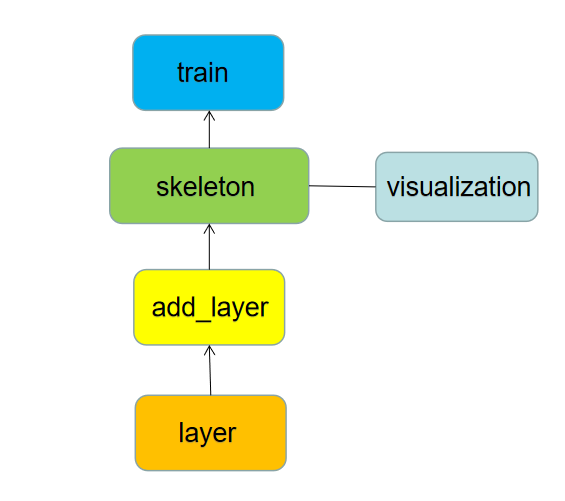

# Ournn:A deep learning framework customized for numpy that integrates training and visualization 

## About Ournn：
1. Ournn is a deep learning framework tailored for numpy. It is committed to achieving deep learning with data in numpy format. Its main goals are as follows :    
* Trainable
      * Being able to carry out the most basic deep learning training is the most basic goal of the framework.
    * Performance up to standard
      * We will improve from several perspectives: 1. Develop the GPU version of the numpy data package. 2. Make changes to the more computationally complex parts of the framework, and at the same time strive to take the hardware factors into account in the framework design process.
    * Visualization
      * Visualization is an indispensable link in deep learning research. We are committed to encapsulating some important visualization links into the framework so that users can avoid the cumbersome process of collecting data and visualizing themselves.
    * Concise and concise
      * We hope to simplify the process of building neural networks so that people can get started quickly without much experience in using the framework. This is the ultimate goal of this project.


2. In order to achieve the above goals, we have paid a certain amount of energy, and we have made some progress so far:
    * Common functions
      * We have encapsulated some of the most basic functions in the framework: 1. Neural network fully connected layer, convolutional layer and individual activation function and loss function.
    * Build a network
      * Since we are students engaged in basic research in this field, we have experience in using other frameworks. By referring to other people's frameworks and combining the individual's lazy spirit, I have designed a more convenient network construction method in my mind, which is described in detail below.


3. We also clearly recognize that the project is still some distance away from the ultimate goal, so our next focus is on:
    * Further optimize the overall design ideas.
    * Supplement and perfect the various functions needed for deep learning at present. 
    
------------------------------------------------------------------------


Folder|Introduction|
:---:|:---|
"Layer"|"Layer" contains two folders, "activations.py" and "layers.py". "layers.py" contains layers commonly used in deep learning such as fully connected and convolutional layers. "Activations.py" contains commonly used activation functions such as "relu"|
"Tools"|"matrix_tools.py" are tools related to matrix operations, such as matrix broadcasting, matrix dot multiplication, zero_padding, etc.; "pre_process.py" involves some data preprocessing, such as hot encoding or training Data, test data set segmentation, etc.; "visualization.py" is responsible for visualization during or after training, etc. |
"Frame.py"|This is the skeleton of the frame, instantiating this class can realize the subsequent training process. "add": This method can encapsulate the layer into the model, and the parameters can be selected to instantiate a neural network layer or a list containing neural network layers; "train": model training "backward": back propagation; "predict ": forward propagation; "save_weights": save weights; "load_weights": load weights; "show_info": load model parameters and dimensional information; "visualization": training visualization |
"Losses.py"|Commonly used loss functions, currently including cross entropy and MSE|
"Optimizers.py"|Optimizer, currently only SGD|

-------------------------------------------------- ----------------------

## Instructions
### 1. Installation
The first step is to find the environment path path of your compiler, after opening the Linux terminal

    cd path

The second step is to clone Ournn. If you encounter problems with the download, please change the source or add a mirror behind the clone.
    
    git clone https://github.com/stevezhangz/ournn.git
    # Modify the name of the package
    mv ournn-main ournn

The third step is to install numpy

    sudo apt-get install pip3
    sudo apt-get install ipython3
    pip3 install numpy

    
 Finally, verify that the framework is available. Note that I used a data set in tensorflow for convenience. If you don’t have tensorflow, you can replace the data set with random numbers of the same size.
 
    ipython3 ournn/test.py 
### 2. Example of building a model
First give the complete process:


    import numpy as np
    from tensorflow.keras.datasets import mnist
    from ournn.tools.preprocess import sparse_one_hot_encode
    from ournn.tools.matrix_tools import *
    from ournn.frame import skeleton
    from ournn.Layer.layers import *
    from ournn.optimizers import *
    from ournn.losses import *

    #Load mnist data set
    (x,y),(t,d)=mnist.load_data()
    x=np.expand_dims(x,axis=-1)
    y=y.reshape(-1,1)
    x,y=x[0:400],y[0:400]
    x=(x-x.max())/(x.max()-x.min())
    #Hot coding
    y=sparse_one_hot_encode(y)
    #Initialization framework
    sk=skeleton(name="Model1",Regularization=None)
    #Add different layers to the frame
    sk.add(
        [
        Conv2d(kernal_size=(5,5),padding=True,stride=2,channel_in=1,channel_o=3),
        Flatten(),
        Fully_connected( output_dim=500,act="relu"),
        Fully_connected( output_dim=100,act="relu"),
        Fully_connected(output_dim=10,act="relu")
        ]
    )
    #Optimizer
    optimizer=SGD(loss=sparse_softmax_cross_entropy(),sample_size=0.7,lr=1e-5)
    #training
    history=sk.train(x,y,epoches=20,train_test_split=0.7,optimizer=optimizer)
    #Display dimension information
    sk.show_info()
    #Draw loss and precision
    sk.visualization()

    
Models can be spliced ​​with each other, as shown below:
    

    #Initialization framework
    sk1=skeleton(name="Model1",Regularization=None)
    sk2=skeleton(name="Model2",Regularization=None)
    #Add different layers to the frame
    sk1.add(
        [
        Conv2d(kernal_size=(5,5),padding=True,stride=2,channel_in=1,channel_o=3),
        Flatten(),
        Fully_connected( output_dim=500,act="relu")])
    sk2.add(
        [
        Fully_connected( output_dim=100,act="relu"),
        Fully_connected(output_dim=10,act="relu")
        ]
    )
    sk1+sk2 #splicing sk2 into sk1

    
 At the same time, neural network layers can be added to the model layer by layer.
 

     sk=skeleton(name="Model1",Regularization=None)
     conv1=Conv2d(kernal_size=(5,5),padding=True,stride=2,channel_in=1,channel_o=3)
     flat=Flatten()
     fc=Fully_connected( output_dim=500,act="relu")
     fc2=Fully_connected( output_dim=100,act="relu")
     fc3=Fully_connected(output_dim=10,act="relu")
     sk.add(conv1)
     sk.add(flat)
     sk.add(fc)
     sk.add(fc2)
     sk.add(fc3)


Of course, if you want to build a network freely, you can also freely match after calling the function: 


     conv1=Conv2d(kernal_size=(5,5),padding=True,stride=2,channel_in=1,channel_o=3)
     flat=Flatten()
     fc=Fully_connected( output_dim=500,act="relu")
     fc2=Fully_connected( output_dim=100,act="relu")
     fc3=Fully_connected(output_dim=10,act="relu")
     layers=[ conv1,flat,fc,fc2,fc3]
     layers_bac=layers[::-1]
     SGD.optimizer(x, y layers, layers_bac, epoches=100,loss=sparse_softmax_cross_entropy(),sample_size=0.7,lr=1e-5)

 A more concise method will be updated in the future
    
  -------------------------------------------------- ----------------------
## Feedback
If you have any questions in use, please feel free to give me feedback. You can use the following contact information to communicate with me

* Mail (stevezhangz#163.com, replace # with @)
* WeChat:


-------------------------------------------------- ----------------------
## Donate to the developer
* Driven by interest, write a `free` thing.
* But if you want to fund the author, the author will gladly accept it, hahahaha.
    
    
 
 
  -------------------------------------------------- ----------------------
## Thankful
Thanks for the following

* [numpy](https://numpy.org/)
* [matplotlib](https://matplotlib.org/)


-------------------------------------------------- ----------------------
## About me 
```
 {
  Name  : "steve",
  state: Do research and preparing to apply for PhD of AI. Except for the above,  I'm single now, hhh.
}
```
